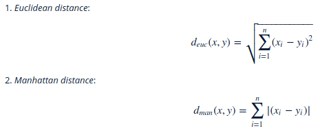

# Chapter 4 Clustering and classification
Created on 26.11.2017
@author: Xiaodong Li
This is the script for RStudio exercise 4 -- Clustering and classification
The work focuses on exploring data and performing clustering methods which try to find the clusters (or groups) from the data. Clustering means that some points (or observations) of the data are in some sense closer to each other than some other points. Based on a successful clustering, we may try to classify new observations to these clusters and hence validate the results of clustering. This week's data is the Boston data from the MASS package.

## Step 0: Import packages
```{r}
library(MASS)
library(corrplot)
library(tidyr)
library(dplyr)
library(ggplot2)
```

##Step 1: Load and explore the data
```{r}
data("Boston")
str(Boston)
dim(Boston)
```
The `Boston` data describes the housing values in the suburs of Boston. Is contains 14 variables which describe the situations of the housing environment like `crim`: per capita crime rate by town; `lstat`: lower status of the population (percent). In each variable there are 506 observations giving the detailed data of the coresponding variable.
##Step 2: The correlations between variables
The function `cor()` can be used to create the correlation matrix. A more visual way to look at the correlations is to use `corrplot()` function (from the corrplot package).
```{r}
cor_matrix<-cor(Boston) %>% round(2)
corrplot(cor_matrix, method="circle",type='upper',cl.pos='b',tl.pos='d',tl.cex=0.6)
```
The corrplot shows the correlations between variables of the Boston dataset. The darker color in the corrplot indicates more straight corelation. Blue color means a positive correlation while red color means a negative correlation. Then from the figure we can summarise that `rad` (index of accessibility to radial highways) and `tax` (full-value property-tax rate per \$10000) have very strong positive correlation. And `dis` (weighted mean of distances to five Boston employment centres) very strong negative correlations with `nox` (nitrogen oxides concentration), `age` (proportion of owner-occupied units built prior to 1940) and `indux` (proportion of non-retail business acres per town). `medv` (meidan value of owner-occupied homes in \$1000) and `lstat` (lower status of the population) have very strong negative correlation too. 
##Step 3: Scale the whole dataset
In the scaling we subtract the column means from the corresponding columns and divide the difference with standard deviation. 
$scaled(x) = \frac{x - mean(x)}{ sd(x)}$
```{r}
boston_scaled <- scale(Boston)
summary(boston_scaled)
```
The variables changed according to the formula shown above. After the scaling, we can see that the data are all quite near 0 which is the mean value of the variable. Negative values mean that the data are less than the mean value while the positive figures mean that the data are bigger values than the mean value.  
We want to cut the variable by quantiles to get the high, low and middle rates of crime into their own categories.  
```{r}
boston_scaled=as.data.frame(boston_scaled)
bins=quantile(boston_scaled$crim)
crime=cut(boston_scaled$crim, breaks = bins, include.lowest = TRUE, label = c('low','med_low','med_high','high'))
table(crime)
boston_scaled=select(boston_scaled, -crim)
boston_scaled=data.frame(boston_scaled, crime)
n <- nrow(boston_scaled)
ind <- sample(n,  size = n * 0.8)
train <- boston_scaled[ind,]
test <- boston_scaled[-ind,]
correct_classes <- test$crime
test <- select(test, -crime)
```
First, we use the quantiles as the break points and creat a categorical variable of the crime rate in the Boston dataset. Then the old crime rate variable is dropped from the old crime rate variable. And then the dataset is divided into train and test sets where 80% of the data belongs to the train set.  
##Step 4: Linear discriminant analysis
**Linear Discriminant analysis** is a classification (and dimension reduction) method. It finds the (linear) combination of the variables that separate the target variable classes. The target can be binary or multiclass variable.
```{r}
lda.fit <- lda(crime~., data = train)
lda.arrows <- function(x, myscale = 1, arrow_heads = 0.1, color = "red", tex = 0.75, choices = c(1,2)){
  heads <- coef(x)
  arrows(x0 = 0, y0 = 0, 
         x1 = myscale * heads[,choices[1]], 
         y1 = myscale * heads[,choices[2]], col=color, length = arrow_heads)
  text(myscale * heads[,choices], labels = row.names(heads), 
       cex = tex, col=color, pos=3)
}
classes <- as.numeric(train$crime)
plot(lda.fit, dimen = 2,col=classes,pch=classes)
lda.arrows(lda.fit, myscale = 3)
```
LDA can be visualized with a biplot. A Biplot is an enhanced scatterplot that uses both points and vectors to represent structure. A biplot uses points to represent the scores of the observations on the principal components, and it uses vectors to represent the coefficients of the variables on the principal components.  
`Points`: Points that are close together correspond to observations that have similar scores on the components displayed in the plot. To the extent that these components fit the data well, the points also correspond to observations that have similar values on the variables.
`Vectors`: A vector points in the direction which is most like the variable represented by the vector. This is the direction which has the highest squared multiple correlation with the principal components. The length of the vector is proportional to the squared multiple correlation between the fitted values for the variable and the variable itself.
##Step 5: Predict LDA
The function `predict()` can be used to predict values based on a model.  
We used the test data got from Step 3 where the crime categories is saved as `correct_classes` and the categorical crime variable is removed from the the test dataset.
```{r}
lda.pred=predict(lda.fit,newdata=test)
table(correct=correct_classes,predicted=lda.pred$class) %>% addmargins
```
From the cross table we can see that the model could give relatively good predictions of the crime rate especially at high rate district. The correct prediction rates are shown below:
```{r}
correct=c(16,23,13,26)
correct=c(correct,sum(correct))
sumdata=c(27,30,18,27)
sumdata=c(sumdata,sum(sumdata))
index=c('low','med_low','med_high','high','sum')
t=data.frame(correct=index,predict=correct,sum=sumdata)
t$percentage=t$predict/t$sum
t
```
From the table we can see that on the whole the corrected prediction precentage is 76.5% and the percentage increases with the increase of crime rate. The model is more suitable for predict high crime rate area.  
##Step 6: Distance measures and clustering
**Distance measurements**  
Similarity and dissimilarity of objects can be measured with distance measures. There are many different measures for different types of data. Here we perform *Euclidean distance* and *Manhattan distance* for the data.
```{r}
data('Boston')
boston_scaled=scale(Boston)
dist_eu=dist(boston_scaled,method='euclidean')
summary(dist_eu)
dist_man=dist(boston_scaled,method='manhattan')
summary(dist_man)
```
The calculations of thest two distances are:  
  

**K-means**  
K-means is maybe the most used and known clustering method. It is an unsupervised method, that assighs observations to groups or cluster based on similarity of the objects.  
Three clusters is tried first.  
```{r}
km=kmeans(boston_scaled,centers = 3)
pairs(boston_scaled,col=km$cluster)
```
**Find the optimal number of cluster**  
One way to determine the number of clusters is to look at how the total of within cluster sum of squares (WCSS) behaves when the number of cluster changes. When you plot the number of clusters and the total WCSS, the optimal number of clusters is when the total WCSS drops radically.  
```{r}
set.seed(123)
k_max=10
twcss=sapply(1:k_max,function(k){kmeans(boston_scaled,k)$tot.withinss})
qplot(x=1:k_max,y=twcss,geom='line')
```
According to the line figure shown above, the most radically drop of the line happens when the K value is 2. So the optimal number of clusters is 2.   
```{r}
km=kmeans(boston_scaled,centers=2)
pairs(boston_scaled,col=km$cluster)
```
From the figure we can see that, for most of the variables, the k-means method could classify the results quite well.  
The method of calculating K-means:  
1. Choose the number of clusters and initial centroids.  
2. Calculate distances between centroids and data points.  
3. For all the data points: assign data point to clusters based on which centroid is closest.   
4. Update centroids: within each cluster, calculate new centroid.  
5. Update cluster: calculate distances between data points and updated centroids. If some other centroid is closer than the cluster centroid where the data point belongs, the data point changes cluster.  
Continue updating steps until the centroids or the clusters do not change.  
K-means is a quick and simple method to cluster analysis. It aims to partition n observations into k clusters in which each observation belongs to the cluster with the nearest mean, serving as a prototype of the cluster.  
However, the number of clusters k is very unpredictable. In this example, we used a simple way to find the optimal k value. But we must remember that, an inappropriate choice of k may yield poor results.  
The choice of the initial cluster center has a great impact on the clustering result. Once the initial value is not chosen well, it may not be able to get a valid clustering result. The K-means method randomly assigns the initial cluster centers and this is a major issue of K-means algorithms. We used the function `set.seed()` to deal with the problem, but usually we need to choose the initial centers quite well.   


